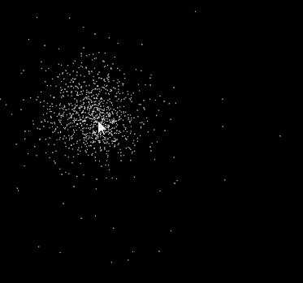

# Doodle

(WIP)

A typescript wrapper for the 2D HTML canvas. Defines a global `doodle` object that automatically resizes the canvas, and updates any elements bound to it on each animation frame. Some default elements are supplied, and the user can plug in their own.

## Features:

- An interface to plug in your own custom canvas objects
- Implementation of basic graphics, math and physics functions.

## Quickstart

Install the dependencies and use gulp to fire up ther demo:

```
npm install
gulp
```

Head into src/doodle/viewElements/Ball.ts and try tweaking the move() method. Refresh the browser to see how your changes affect the demo.

Try defining your own canvas component - make a class with an update() method following the template of ball.ts - it can do anything. Then in app.ts register your element to the doodle object.

Have fun!

